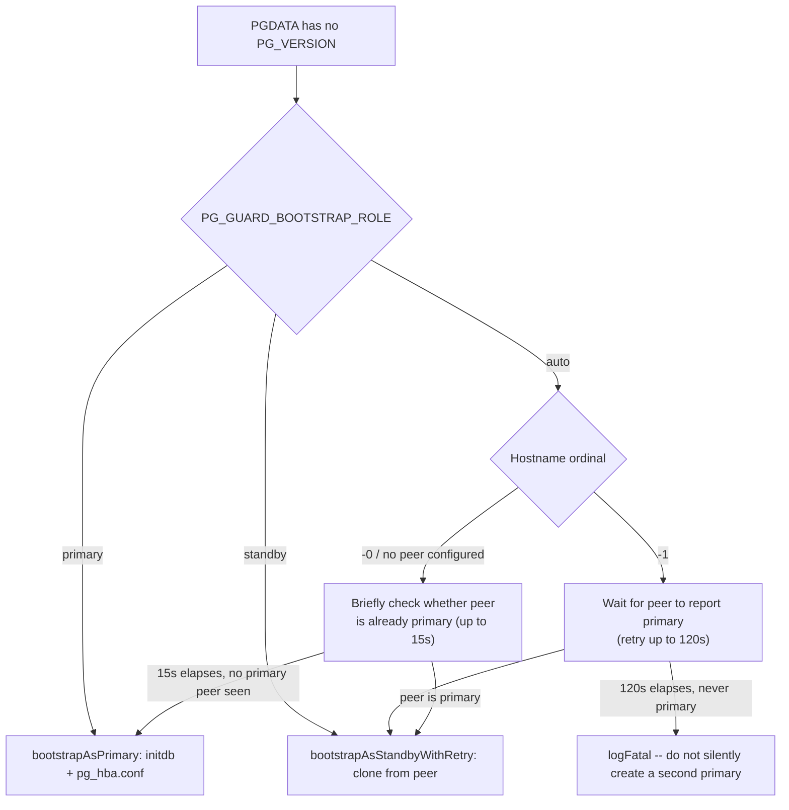
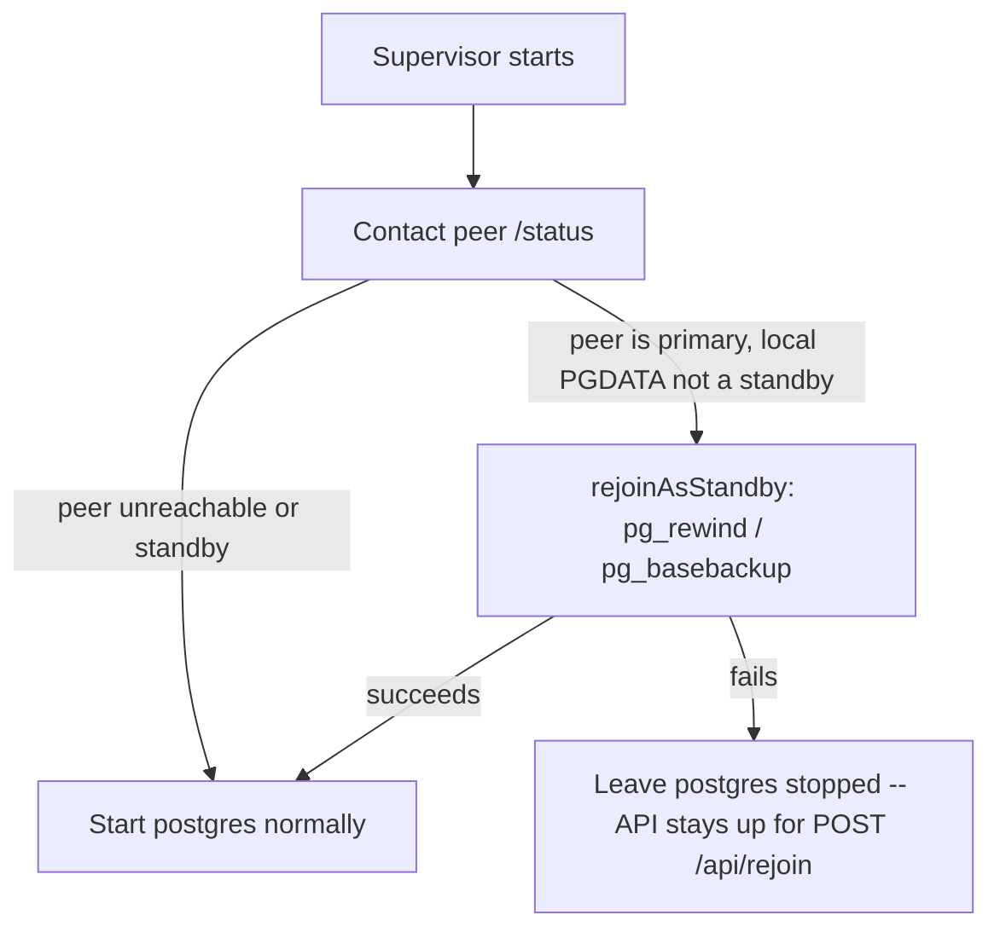
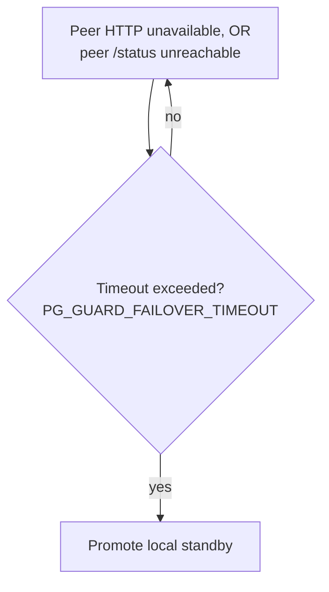
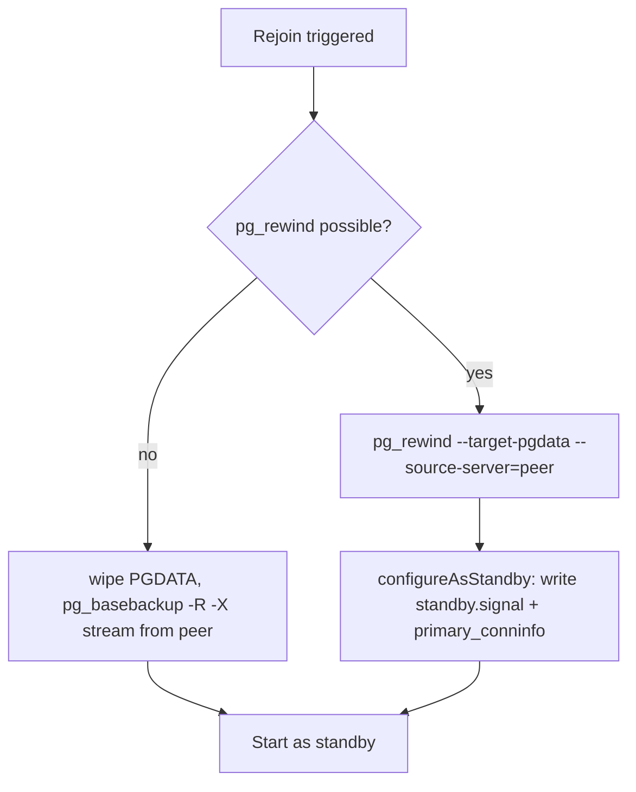
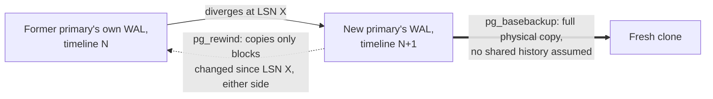

# pg-guard architecture

This covers *why* `pg-guard` behaves the way it does internally: how it
talks to Postgres, how the two nodes talk to each other, the bootstrap
tiebreak algorithm, the coordinated-shutdown protocol, `pg_rewind` vs.
`pg_basebackup`, and the process/signal model on each platform. None of
this is required reading to *deploy or operate* `pg-guard` -- see
[`README.md`](README.md) for that (configuration, TLS, the REST API, shutdown modes).
See [`TESTING.md`](TESTING.md) for dev/test tooling.

## Command Execution vs. Direct Connection

`pg-guard` talks to PostgreSQL two different ways, chosen per operation, not
as a blanket policy.

**Shell out to the official binaries** (already present in the image/install
-- never reimplemented) for anything that operates on the data directory
itself, including while the server isn't running as a connectable process:

| Task | Tool |
|------|------|
| Graceful stop on Windows (no real SIGTERM/SIGINT delivery to a child process there) | `pg_ctl stop -m fast` |
| Resync a diverged former primary | `pg_rewind` |
| Full resync/clone from the new primary | `pg_basebackup` |
| Cheap "is the socket accepting connections yet" check before a real session is viable | `pg_isready` |
| Inspect a *stopped* cluster's state (last checkpoint, timeline) to decide rewind vs. basebackup | `pg_controldata` |

**Connect directly via `pgx`** (native interface, not `database/sql`) over
the local connection for anything that's a live query or SQL call against a
*running* server:

- `pg_is_in_recovery()`, `pg_stat_replication`, `pg_last_wal_receive_lsn()`/`replay_lsn()`, `pg_current_wal_lsn()` -- role detection and replication lag
- `SELECT pg_promote()` -- promotion is a SQL function as of PG12, no `pg_ctl promote` needed
- Prometheus metric collection (`/metrics`) -- a repeated scrape, not a one-off call
- The catch-up-wait loop during a planned switchover, which polls LSN positions on a tight interval

Shelling out to `psql` for these would mean a fork/exec plus a fresh
connection and auth handshake per check, and parsing text/tabular output
back into typed values -- too slow and fragile for sub-second polling during
a switchover or a metrics scrape. A pooled `pgx` connection avoids all of
that. **Implemented**: `db.go` connects via `pgxpool` over TCP to
`127.0.0.1:PGPORT` (not a Unix socket -- identical on Linux and Windows),
lazily (doesn't require Postgres to be up yet at pool creation). Role
detection, replication lag/connected state, and `pg_promote()` are all
real; the switchover catch-up-polling loop isn't (no switchover logic
exists yet).

`pg-guard` on one node never opens a *database* connection to the peer node
-- cross-node role/health awareness goes only through the pg-guard-to-pg-guard
HTTPS API. The Postgres replication stream between the two nodes is separate
and stays entirely under Postgres's own control, using the replication user.

## Communication

Each node exposes two separate HTTP listeners: the API port
(`http://pg-traveler-0:8080` plain, or `https://pg-traveler-0:8443` once
TLS is configured -- see [`README.md`](README.md)'s TLS section -- `PG_GUARD_PEER_PORT`)
for `POST /api/*`, and the metrics port (`http://pg-traveler-0:9100`,
always plain, `PG_GUARD_PEER_METRICS_PORT`) for `GET /health`|`/status`.
Nodes talk directly to each other -- no third component. **Implemented**:
`peer.go`'s `checkPeerReachable` (plain `GET /health` against the peer's
metrics port, 2s timeout) backs `/status`
and the `postgres_ha_peer_reachable`/`postgres_ha_peer_last_seen_seconds`
metrics; `fetchPeerStatus` (`GET /status`, metrics port) and
`requestPeerPromote` (`POST /api/promote?force=true`, API port) drive the
coordinated handover sequence (see Coordinated Shutdown below), the
startup rejoin check (see Rejoin below), and the promote safety guard (see
[`README.md`](README.md)'s REST API section).

## Bootstrap

**Implemented** (`bootstrap.go`, run once before the Startup flow below, on
every platform -- no init container, no manual first-run script needed):



- **As primary**: `initdb` (via `runLoggedCommand`, so its output flows
  through pg-guard's own logger -- see [`README.md`](README.md)'s Logging section), then
  `pg_hba.conf` gets a `host replication <PG_GUARD_REPL_USER> <peer IP>/32
  ...` entry scoped to just the configured peer (not `all`) plus a general
  entry for application connections. The peer is resolved to an IP up
  front, not left as a hostname: Postgres's hostname matching in
  `pg_hba.conf` reverse-resolves the *connecting client's* IP and compares
  that name against the rule (Docker's reverse DNS on a Compose network
  returns `<service>.<project>_default`, which a plain hostname entry
  won't match) -- an IP-based rule sidesteps that entirely, and matches
  Postgres's own documented preference for IP over hostname rules anyway.
  Auth mode is `trust` if `POSTGRES_PASSWORD` is
  unset (dev/test, matching today's defaults), or `scram-sha-256` with a
  password file if it's set -- a fresh bootstrap can now actually produce a
  password-protected cluster. Database/role creation (`POSTGRES_DB`,
  `PG_GUARD_REPL_USER` if different from `POSTGRES_USER`) happens
  idempotently via `pgx` (`ensureRoleAndDatabaseBlocking`/
  `ensureRoleAndDatabase`) once postgres is actually running -- not shelled
  out to `psql`, consistent with Command Execution vs. Direct Connection
  above. This blocks starting the HTTP API, deliberately: a peer's
  bootstrap-as-standby decides to run `pg_basebackup` the moment this
  node's `/status` reports `primary`, using `PG_GUARD_REPL_USER` -- if the
  API were serving requests while that role was still being created in the
  background, a peer polling at exactly the wrong moment could see
  "primary" and attempt to connect as a role that doesn't exist yet (a real
  failure hit in testing). Nothing external can observe this node as usable
  until its own setup is actually done.
- **As standby**: reuses `runBasebackup` (the same function Rejoin's
  fallback path uses) -- no separate implementation. `PGDATA` doesn't need
  to already exist.
- The hostname-ordinal tiebreak only matters when *neither* node has an
  opinion yet (both starting cold, first cluster init ever) -- if the peer
  already reports a role, that always wins regardless of ordinal, so a
  disaster-recovery re-bootstrap of the `-0` node against an
  already-running `-1` primary still correctly bootstraps as standby.
- Neither side decides on a single snapshot of the peer's status. `-1`
  waits up to 120s for the peer to report primary, since it's deferring to
  a peer it already expects to exist. `-0` (or a single, peer-less node)
  only waits up to 15s -- short because this is still fundamentally the
  "nothing else exists yet" fallback, not a real wait -- but it's not an
  instant, single-shot decision either: on a concurrent two-node restart
  (both containers/hosts coming up together), the peer's own listener can
  simply not be reachable yet on the very first check, and a brief retry
  window is what tells "no primary exists" apart from "can't tell yet."
  Once either side does see the peer as primary, `bootstrapAsStandbyWithRetry`
  keeps retrying the clone itself (not just the initial "is it primary"
  check) for the remainder of a 120s budget -- the peer reporting itself
  primary doesn't guarantee its own post-promotion setup (creating the
  replication role/database) has finished yet.
- `PG_GUARD_BOOTSTRAP_ROLE=primary`/`standby` overrides the whole decision
  tree, for deployments that would rather be explicit than rely on the
  hostname convention.

### Manual equivalent: what an admin would run by hand

Nothing here is required reading to *use* pg-guard -- self-bootstrap
replaces all of it. It's here because `bootstrap.go`/`rewind.go` doing
this automatically is easy to treat as a black box; seeing the actual
commands (the same ones the old Docker init container ran, before
self-bootstrap replaced it) makes it clear there's no hidden magic, and
gives you the exact sequence to reproduce by hand for debugging or a
from-scratch native install.

**On the primary** (first node, `bootstrapAsPrimary`):

```bash
# 1. initdb -- local (Unix-socket) connections stay trust always; only
#    network connections get a password, and only if POSTGRES_PASSWORD is set.
initdb -D "$PGDATA" -U postgres -E UTF8 --auth-local=trust --auth-host=trust
#   (--auth-host=scram-sha-256 --pwfile=<tmpfile with the password> instead,
#    if POSTGRES_PASSWORD is set -- see writeBootstrapHBA)

# 2. Grant the standby replication access, scoped to its resolved IP (not
#    "all", and not its hostname -- see writeBootstrapHBA's comment on why
#    IP-based, not hostname-based) -- plus a general application-access line.
cat >> "$PGDATA/pg_hba.conf" <<EOF
host replication replicator <standby-ip>/32 trust
host all all all trust
EOF

# 3. Enable wal_log_hints -- required for pg_rewind to run at all later
#    (see Resync below for why); inherited by every standby automatically
#    since pg_basebackup clones the whole data directory.
echo "wal_log_hints = on" >> "$PGDATA/postgresql.conf"

# 4. Start it (pg-guard execs postgres directly as PID 1 instead of pg_ctl).
pg_ctl -D "$PGDATA" -w start

# 5. Once running -- idempotent, see ensureRoleAndDatabase:
psql -d postgres -c "CREATE ROLE replicator WITH REPLICATION LOGIN"
psql -d postgres -c "CREATE DATABASE traveler WITH OWNER postgres ENCODING 'UTF8'"
psql -d postgres -c "CHECKPOINT"   # see ensureRoleAndDatabase's comment on why
```

**On the standby** (second node, `runBasebackup`):

```bash
# One command clones the entire cluster from the primary and configures it
# as a standby -- pg_basebackup's -R flag writes standby.signal and
# primary_conninfo (in postgresql.auto.conf) automatically; nothing else
# needed before starting it.
PGPASSWORD=<replicator's password, if any> pg_basebackup \
  -h <primary-host> -p 5432 -U replicator \
  -D "$PGDATA" -P -R -X stream

pg_ctl -D "$PGDATA" -w start   # comes up in standby mode on its own
```

That's the entire first-run sequence -- everything else (role/database
creation above, the replication grant, ongoing health/role tracking) is
handled the same way on every subsequent startup too, not just this first
one (see `ensureRoleAndDatabase`/`ensureReplicationHBA`).

## Startup

**Implemented** (`shouldRejoinAtStartup`/`startPostgres` in `main.go`, run
after Bootstrap above, before the first `sup.start()` call in the process's
life):



This single check doubles as the automatic side of Rejoin below: the same
code path runs whether it's a fresh container start or the restart that
follows a switchover's sentinel exit code.

First cluster initialization can use explicit configuration (which node
starts as primary).

## Planned Shutdown / Switchover

**Implemented** (`coordinateHandover` in `handover.go`, shared by
`SIGTERM`/`SIGINT`, `POST /api/shutdown`, and `POST /api/switchover` --
they differ only in the exit code used afterward, and for shutdown, that it
always means "don't come back"):

```mermaid
sequenceDiagram
    participant P as Primary
    participant S as Standby
    P->>S: GET /status (verify healthy standby)
    P->>P: stop local PostgreSQL
    P->>S: POST /api/promote?force=true
    S->>S: promote
    P->>S: poll GET /status (confirm peer became primary, up to 10s)
    P->>P: exit (0 for shutdown; sentinel restart code for switchover)
```

No in-process "restart the child" capability was needed for this: pg-guard's
own **process exit code** is the restart signal. `docker/docker-compose.yml`
uses `restart: on-failure` (not `always` -- that would restart regardless of
exit code, breaking real shutdown). Real shutdown exits `0` and the
container stays down; switchover exits a sentinel non-zero code, `restart:
on-failure` brings the container straight back up, and the Startup
section's rejoin check detects the peer is now primary and rejoins
automatically -- implementing both Startup and the automatic side of
Rejoin with one check.

**Standby shutdown/switchover** (target is a standby, not primary): same
`coordinateHandover` call, just without a peer-promotion step to wait on
(`switchover` is refused with `400` on a standby; `shutdown` on a standby
runs the same stop-and-confirm-peer-still-healthy sequence).

## Coordinated Shutdown

`PG_GUARD_SHUTDOWN_POLICY` (`require-switchover` default \| `best-effort` \|
`force`) governs how strict the handover in Planned Shutdown / Switchover
above is:

- **`require-switchover`:** refuses (returns an error, stops nothing) unless
  the peer is reachable, reports itself standby, and confirms primary
  within 10s of the promote request.
- **`best-effort`:** same checks, but only logs a warning and proceeds
  regardless of whether they pass.
- **`force`:** skips peer coordination entirely -- plain stop-and-wait,
  identical to pg-guard's original pre-HA behavior.

For `SIGTERM`/`SIGINT` specifically, a `require-switchover`/`best-effort`
refusal still falls back to a forced local stop -- the OS/orchestrator is
asking pg-guard to terminate, so it must eventually comply even when a
clean handover isn't possible right now. `POST /api/shutdown` and
`POST /api/switchover` have no such fallback: a refusal returns `409` and
postgres keeps running untouched, by design.

**Simplified vs. the original design:** true bidirectional negotiation
(a standby detecting *its specific* peer is shutting down and
cancelling/promoting on its own initiative, with no API call from the
peer) is not implemented -- what ships is one-directional, always
initiated by whichever node received the shutdown/switchover request. Real
safety (a standby's own shutdown still checks the primary is healthy first
under `require-switchover`), just not the full cancel-and-promote dance,
which needs more signaling infrastructure than this pass builds.

## Failover

**Implemented** (`startFailoverMonitor` in `failover.go`, a background
goroutine started alongside the API server, active whenever
`PG_GUARD_FAILOVER_MODE=automatic`, the default):



Ticks every 5s; only evaluates the peer while the local node is a healthy,
running standby (skips entirely if already primary or if local postgres
itself isn't reachable). Tracks how long the peer has been continuously
unhealthy and promotes locally via the same `pg_promote()` the manual
endpoint uses once that exceeds `PG_GUARD_FAILOVER_TIMEOUT` (default
`60s`) -- logged at error level since it's consequential and autonomous.

**v1 assumption:** enterprise environment -- peer unreachability is treated
as server loss, not an arbitrary network partition. This assumption is
deliberate and must stay documented, not silently generalized.

## Rejoin

**Implemented** (`rejoinAsStandby` in `rewind.go`; the startup trigger is
`rejoinAtStartupIfNeeded` in `main.go`). Two entry points, with
deliberately different retry behavior:

- **At startup**, every restart, automatic: `rejoinAtStartupIfNeeded`
  retries the whole "is the peer actually primary?" decision -- not just a
  single snapshot -- for up to 30s. A confirmed answer either way (peer
  reachable and explicitly reports non-primary, or local `PGDATA` is
  already configured as a standby) returns immediately; only an
  *inconclusive* result -- the peer unreachable or erroring -- keeps
  retrying. If the peer never becomes reachable at all within the window,
  postgres is left stopped rather than silently starting up as a possibly-
  stale primary, matching Bootstrap's `-1` tiebreak: fail loud rather than
  risk a second primary.
- **`POST /api/rejoin`**: a single, direct call to `rejoinAsStandby` -- no
  "wait and see if the peer becomes primary" retry, since this is an
  explicit admin action taken with the peer's state already known. Only
  valid while postgres isn't currently running under the supervisor.

Once either path decides a rejoin is actually needed, the clone mechanism
itself is the same:



`pg_rewind` doesn't create `standby.signal`/set `primary_conninfo` the way
`pg_basebackup -R` does, so `configureAsStandby` writes those manually
after a successful rewind. A former primary does **not** start writable
after this: it always comes back through this path as a standby.

## Resync: what "getting back in sync" actually means on the PostgreSQL side

The Rejoin flow above is the *code path*; this section is the underlying
*mechanism* -- written for Domino admins/DBAs who know exactly what "get a
replica back in sync" means operationally but haven't necessarily worked
with PostgreSQL's own replication internals before. Nothing here is
Traveler- or Domino-specific -- it's how any two PostgreSQL nodes
resynchronize, explained once so the Rejoin diagram's two branches make
sense as engineering decisions, not just function names.

### The three concepts that matter

- **WAL (Write-Ahead Log).** Every change to the database is first
  appended to a sequential log *before* it's applied to the actual data
  files -- the log record is the durable fact; applying it to the data
  files is just a performance optimization (a page can always be
  reconstructed by replaying WAL). Streaming replication is, literally,
  the primary shipping this same log to the standby in real time, which
  replays it as it arrives. There is no document-level or row-level
  replication happening -- it's a byte-level log of physical changes.
- **LSN (Log Sequence Number).** A monotonically increasing byte offset
  into the WAL stream -- Postgres's "position in the log." Every WAL
  record has one; `replication_lag_bytes` ([`README.md`](README.md)'s `GET /status`,
  `/metrics`) is the gap between the primary's current LSN and the
  furthest-behind standby's.
- **Timeline.** Every time a standby is promoted (`SELECT pg_promote()`,
  see [`README.md`](README.md)'s REST API section for `POST /api/promote`), Postgres
  starts a new timeline: a new branch in the WAL history, recorded
  permanently in a small `.history` file. This exists specifically so two
  servers that both descend from the same original data can never be
  confused about which one's WAL is authoritative after a promotion -- the
  promoted node's WAL from that point on belongs to a new timeline number,
  distinct from whatever the old primary might still generate if it's
  still running.

### Why a node ends up needing this at all

Any node that wasn't continuously receiving and replaying WAL from the
*current* primary is, by definition, no longer known to be in sync with
it -- a crash, a coordinated handover, a `POST /api/maintenance` stop, or
simply having been the primary itself before a promotion happened
elsewhere. `shouldRejoinAtStartup` (Startup, above) is what actually
detects this: the peer reports itself primary, and this node isn't
already configured as its standby.

### Two ways to actually resynchronize the data directory



- **`pg_rewind` (the fast path).** Compares the target's (this node's)
  timeline against the source's (the peer's) and finds the exact LSN
  where they diverged, then copies *only the data blocks that changed on
  either side since that point* -- not a full copy. For a large database
  where the two nodes were only briefly out of step (the normal case
  after a clean switchover or a short crash), this is a small fraction of
  the actual data size. It works because Postgres can prove, block by
  block, "this page is identical" or "this page changed" without
  re-reading everything -- but that proof depends on either
  `wal_log_hints = on` or `data_checksums` being enabled, since otherwise
  a harmless hint-bit change (metadata Postgres opportunistically updates
  on read, unrelated to the actual row data) can't be told apart from a
  real content change. **pg-guard enables `wal_log_hints` at first
  bootstrap** (`writeBootstrapPostgresConf`, `bootstrap.go`) specifically
  so `pg_rewind` has this available -- without it, Postgres refuses to run
  `pg_rewind` at all, and every rejoin would silently fall back to the
  full re-clone below regardless of how small the actual divergence was
  (confirmed as exactly what was happening before this was added: the
  `pg_rewind` branch was unreachable in every real test run this session).
  Because it's a physical, timeline-aware operation, `pg_rewind` also
  depends on enough of the relevant WAL history around the divergence
  point still being retained (governed by `max_wal_size`/`wal_keep_size`,
  neither of which pg-guard currently tunes, and there's no replication
  slot reserving it) -- if that WAL has since been recycled, rewind isn't
  possible and pg-guard falls back automatically. Keeping outages short
  (`PG_GUARD_REBOOT_GRACE_PERIOD` for planned ones) reduces how often this
  comes up, but doesn't eliminate the possibility -- a replication slot
  guaranteeing retention is the actual fix and isn't implemented yet.
- **`pg_basebackup` (the always-correct fallback).** Makes no assumption
  about shared history at all: it's a full physical copy of the entire
  data directory from the primary's current state, the same mechanism
  used for an initial standby clone (Bootstrap, above) or a real backup.
  Slower and more expensive for a large database since everything
  transfers, not just the delta, but it always works regardless of how
  long the node was gone or how far the histories diverged -- it has no
  dependency on old WAL still being retained. `-R` writes
  `standby.signal`/`primary_conninfo` automatically as part of the same
  operation; `pg_rewind` doesn't touch either, so `configureAsStandby`
  writes them by hand afterward (see the Rejoin diagram).

`rejoinAsStandby` always tries `pg_rewind` first and only falls back to
`pg_basebackup` if it fails, for any reason -- so correctness and eventual
availability are never gated on `pg_rewind` specifically working; it's
purely a speed optimization on top of a fallback that's always safe to
use.

## Process Model

**Implemented today.** `pg-guard` execs `postgres` (`PG_GUARD_POSTGRES_BIN`,
`-D PGDATA`, plus any `PG_GUARD_EXTRA_ARGS`) as its one supervised child --
no wrapper script involved on any platform.

**Linux:** forwards whichever of SIGTERM/SIGINT it received rather than
normalizing (Postgres gives those distinct smart-vs-fast shutdown meanings
-- notably, the official image's `STOPSIGNAL` is `SIGINT`, so `docker stop`
triggers a fast shutdown, not a smart one, and forwarding the exact signal
received preserves that intentional choice). This holds through the
coordinated-handover path too, not just the plain wait-then-kill one -- the
received signal is threaded from `runInteractive`'s signal handler through
`handleTerminationSignal`/`coordinateHandover`/`stopLocal` (`handover.go`)
rather than normalized to a constant, so `docker stop`'s `SIGINT` still
reaches postgres as `SIGINT` even when a peer handover runs first.
API-triggered shutdown/switchover have no real OS signal to forward, so
those use `SIGTERM` ("smart shutdown") as a sensible default. As real
container PID 1, it
also reaps every process reparented to it -- not just the tracked child --
via a single `wait4(-1, WNOHANG)`-draining loop woken by `SIGCHLD` (the same
model `tini`/`dumb-init` use; only one waiter may ever collect a given PID's
exit status, so this reap loop is the sole place that waits on any child).
Verified against a real `postgres:17` container running as the non-root
`postgres` user throughout (no root involved at any point, since there's no
`docker-entrypoint.sh` doing a privilege drop -- the container itself starts
non-root, see [`README.md`](README.md)'s Deployment section): confirmed clean PID-1
supervision, clean shutdown, a forced-kill escalation path, and zombie
reaping of both organic and synthetic orphaned processes, with zero left
behind.

**Windows:** `os.Process.Signal()` only implements `os.Kill` there -- no
real SIGTERM/SIGINT delivery to an arbitrary child process -- so graceful
stop shells out to `pg_ctl stop -D <PGDATA> -m fast` instead. Can run
interactively (a normal, non-elevated console process -- Postgres refuses
to run under an admin-flagged token, confirmed) or as a registered Windows
Service:

- `pg-guard.exe -install-service` (needs an elevated prompt -- registering
  with the Service Control Manager is inherently privileged) creates the
  service running as `NT AUTHORITY\NetworkService` -- the same non-admin
  account the official Postgres Windows installer's own service already
  uses -- copies the current `PG_GUARD_*`/`POSTGRES_*`/`PGDATA` environment
  into the service's private registry `Environment` value (a Windows
  Service does not inherit a user session's environment the way an
  interactive shell does), and grants `NetworkService` filesystem access to
  `PGDATA` via `icacls` (a manually-`initdb`'d directory has no such grant
  by default).
- Running the installed service is *not* privileged -- SCM starts it as
  `NetworkService`, and `postgres.exe` inherits that from its parent
  automatically, satisfying Postgres's restriction with zero
  privilege-drop code in `pg-guard` itself.
- `pg-guard.exe -uninstall-service` removes it.
- SCM drives lifecycle via `ChangeRequest`s instead of OS signals; Stop,
  Shutdown, *and* PreShutdown requests all run the same shutdown logic as
  the interactive path, in a goroutine, while periodic `StopPending`
  checkpoints keep SCM from deciding the service is hung during a
  legitimately-long `PG_GUARD_SHUTDOWN_WAIT`.
- **PreShutdown is registered** (`svc.AcceptPreShutdown`), not just
  Stop/Shutdown -- this matters because `PG_GUARD_SHUTDOWN_WAIT` defaults
  to `300s` and coordinated handover can add more on top, which exceeds
  the budget an ordinary Stop/Shutdown gets during a *real* system
  shutdown/reboot. `SERVICE_CONTROL_PRESHUTDOWN` is Windows's own
  mechanism for exactly this case: a service that registers for it gets
  called first, with a 3-minute default budget (`PreshutdownTimeout`,
  itself extendable via the same `StopPending` checkpoints) before the
  regular shutdown sequence even begins. Handled identically to
  Stop/Shutdown, not as a separate code path -- PreShutdown *is* the
  complete shutdown signal for a preshutdown-aware service, not a
  precursor to also receiving a plain Shutdown for the same event.

Both platforms: waits `PG_GUARD_SHUTDOWN_WAIT` for the child to exit after
asking it to stop, then force-kills on timeout -- this is `stopLocal` in
`handover.go`, the bottom layer `coordinateHandover` builds on for the
`force` policy and as its own final step once peer coordination succeeds.

All mutation of the supervised child (`sup`/`currentChild`, see `state.go`)
happens on a single goroutine: the main select loop directly for
`SIGTERM`/`SIGINT`, or via a `handoverRequests` channel for API-triggered
shutdown/switchover/rejoin, so `coordinateHandover` never runs concurrently
with itself or races the crash-detection path over the same child's exit
event. That crash-detection path -- the child exiting on its own, outside
any requested handover -- still just exits pg-guard with the same code
(unchanged since before this milestone): under `restart: on-failure` the
container comes back, re-running the Startup rejoin check, which correctly
recovers a crashed former-primary in place (peer still standby, so no
rejoin needed) as well as a crashed former-standby (re-clones if the peer
is now primary).
