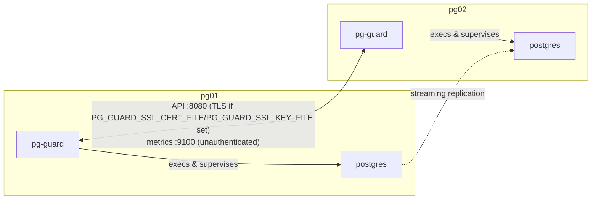
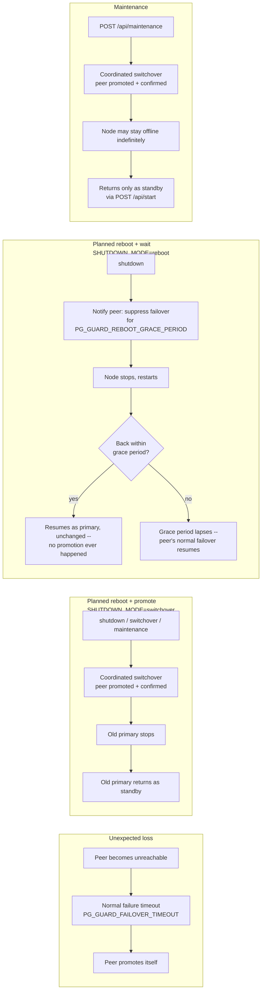

# pg-guard

**PostgreSQL HA Supervisor** -- a single Go binary that adds high availability,
monitoring, and operational control to PostgreSQL, without rebuilding or modifying it.

> Initial driver is HCL Traveler in HA mode (two-node Traveler datastore),
> but the design has no Domino/Traveler dependency -- it targets any two-node
> PostgreSQL primary/standby pair.

`pg-guard` becomes the process that starts and supervises `postgres` directly
(PID 1 in a container; a registered Windows Service on Windows) while adding
HA logic, peer communication, an HTTPS management API, and Prometheus
metrics -- on top of PostgreSQL's own replication, WAL, and recovery
machinery, never in place of it.

This project is intentionally deployment-oriented, not a PostgreSQL fork.

This file covers what an admin needs to deploy, configure, and operate
`pg-guard`. For *why* it behaves the way it does internally (the bootstrap
tiebreak algorithm, the coordinated-shutdown protocol, `pg_rewind` vs.
`pg_basebackup`, the process/signal model on each platform), see
[`ARCHITECTURE.md`](ARCHITECTURE.md). For dev/test tooling, see [`TESTING.md`](TESTING.md).

## Quick Start

The fastest way to see it running: a single node, no HA, `pg-guard` just
supervising `postgres` directly (uses the `docker-compose.yml` in this
directory).

```bash
./build.sh                    # builds bin/pg-guard-linux, used by docker-compose.yml
docker compose up -d          # starts the single-node smoke test
curl localhost:9100/status    # confirm it's up and self-bootstrapped
docker compose down -v        # tear down when done
```

That's it -- `pg-guard` detects the uninitialized `PGDATA`, bootstraps it
itself (no init container, no manual setup step), execs `postgres` as its
direct child, and exposes its API (`:8080`) and metrics/status (`:9100`).
No peer is configured in this stack, so no HA logic runs here -- see
[`TESTING.md`](TESTING.md) for what this file is and isn't, and for the full index of
every dev/test tool in this repo.

To see the actual HA behavior (replication, automatic failover, coordinated
switchover) with two nodes in one command, see [`docker/README.md`](docker/README.md) instead.

## Design Goals

- Keep PostgreSQL untouched; extend deployment, not PostgreSQL itself --
  no custom build, no patches, no extensions.
- No Patroni, no etcd, no HAProxy, no virtual IP, no additional containers,
  no separate orchestration layer.
- No separate config file -- configuration is environment variables only,
  reusing Postgres's own `POSTGRES_*`/`PG*`/TLS conventions wherever
  possible, with reasonable defaults for everything else.
- No shell-script dependency (`docker-entrypoint.sh` or otherwise) on any
  platform -- `pg-guard` always execs the `postgres` binary directly, and
  self-bootstraps an uninitialized `PGDATA` itself (see [`ARCHITECTURE.md`](ARCHITECTURE.md)'s
  Bootstrap section) -- no init container, no platform-specific first-run
  script needed.
- Reuse the platform's own mechanism for privilege/account management
  (`user:` in Compose, `NetworkService` via SCM) instead of building
  privilege-drop code into `pg-guard` itself.
- One binary, one process, one metrics endpoint, one HTTPS API. Two-node
  architecture; operational simplicity over infrastructure complexity.

## Scope

- Exactly two PostgreSQL nodes: one primary, one standby.
- Docker / Docker Compose deployments, and native Linux/Windows.
- Enterprise environments, simple operations.

Not intended to solve arbitrary distributed consensus or large PostgreSQL
clusters.

## Responsibilities

`pg-guard` owns: process supervision, startup, shutdown coordination, HA
logic, peer communication, health, metrics, the management API.

PostgreSQL owns: storage, WAL, replication, recovery, promotion, rewind.

`pg-guard` never reimplements PostgreSQL functionality.

## Architecture



Both nodes run the identical binary; role (primary/standby) is runtime
state, not baked into the deployment. `pg-guard` is PID 1 in a container, or
runs as a Windows Service (`NetworkService`) natively -- either way it is
the direct parent of `postgres`, not a wrapper around some other launcher.
See [`ARCHITECTURE.md`](ARCHITECTURE.md) for how the nodes actually talk to each other and to
Postgres.

## Deployment

`pg-guard` starts `postgres` as its direct child -- confirmed against a real
production container that a correctly-configured deployment runs PID 1 as
`postgres -c ssl=on -c ssl_cert_file=... -c ssl_key_file=...` directly, with
no entrypoint script involved at all. `pg-guard` always does the same:
`PG_GUARD_POSTGRES_BIN` points straight at the `postgres` binary, `PGDATA`
points at an already-initialized cluster. `PG_GUARD_POSTGRES_BIN` is
auto-detected if unset -- via the registry on Windows (the same
`HKLM\SOFTWARE\PostgreSQL\Installations\*` key the official installer
writes) or `/usr/lib/postgresql/*/bin`/`PATH` on Linux -- and only requires
explicit configuration when auto-detection is ambiguous (multiple
installations found) or fails, never guessing silently either way.

Because there is no `docker-entrypoint.sh` doing it for us, two things that
script used to handle are now `pg-guard`'s deployment's responsibility, not
`pg-guard`'s own code:

- **Non-root.** Postgres refuses to run as root/an admin-privileged account
  on any platform. In a container, run as the image's existing `postgres`
  user (`user: postgres` in Compose -- see `docker-compose.yml`). As a
  Windows Service, run as `NT AUTHORITY\NetworkService` (see [`ARCHITECTURE.md`](ARCHITECTURE.md)'s
  Process Model) -- the same account the official Postgres Windows
  installer's own service already uses. `pg-guard` never does its own
  privilege-dropping; it just never starts privileged in the first place,
  on any platform.
- **First-run bootstrap.** `pg-guard` detects an uninitialized `PGDATA` and
  bootstraps it itself, on every platform -- see [`ARCHITECTURE.md`](ARCHITECTURE.md)'s
  Bootstrap section. No init container, no manual first-run step required
  (the `windows/`/`linux/` `init-traveler-db.*` scripts still exist for
  testing raw Postgres without pg-guard involved at all, but pg-guard no
  longer depends on them).

## Configuration

No YAML/JSON config file. Everything is environment variables.

### Reused from Postgres / libpq

These are read as-is -- `pg-guard` never redefines what Postgres already owns.

| Variable | Used for | Default |
|---|---|---|
| `PGDATA` | the data directory `pg-guard` passes to `postgres -D`; must already be initialized | *(required)* |
| `POSTGRES_USER` | local health probe; replication connection fallback | `postgres` |
| `POSTGRES_PASSWORD` | password for the above | *(required by the base image, in container mode)* |
| `POSTGRES_DB` | default DB for health-check queries | `POSTGRES_USER` |
| `PGPORT` | local Postgres port; also assumed to be the peer's Postgres port | `5432` |

### `pg-guard`-specific (no Postgres equivalent)

| Variable | Purpose | Default |
|---|---|---|
| `PG_GUARD_POSTGRES_BIN` | path to the `postgres` binary itself | auto-detected (registry on Windows, well-known paths/`PATH` on Linux); required only if detection is ambiguous or fails |
| `PG_GUARD_EXTRA_ARGS` | additional arguments appended after `-D <PGDATA>`, for anything genuinely extra -- TLS itself is switched on automatically below, not through this | unset |
| `PG_GUARD_API_PORT` | mutating `POST /api/*` routes, plus the same `GET /health`\|`/ready`\|`/status`\|`/metrics` routes as the metrics port -- serves TLS instead of plain HTTP once `PG_GUARD_SSL_CERT_FILE`/`PG_GUARD_SSL_KEY_FILE` are set (see REST API, TLS) | `8080` (or `8443` once TLS is enabled) |
| `PG_GUARD_API_BIND` | bind address for both the API and metrics listeners | `0.0.0.0` |
| `PG_GUARD_METRICS_PORT` | `GET /health`\|`/ready`\|`/status`\|`/metrics` only, always plain HTTP regardless of TLS -- the always-on unauthenticated target for monitoring tools | `9100` |
| `PG_GUARD_PEER_HOST` | explicit peer hostname override | derived from own hostname (see below) |
| `PG_GUARD_PEER_PORT` | peer's API port (`/api/promote`, `/api/reboot-notice`) | `PG_GUARD_API_PORT` |
| `PG_GUARD_PEER_METRICS_PORT` | peer's metrics port (`/health`, `/status`) | `PG_GUARD_METRICS_PORT` |
| `PG_GUARD_SSL_CERT_FILE` / `PG_GUARD_SSL_KEY_FILE` / `PG_GUARD_SSL_CA_FILE` | named after Postgres's own `ssl_cert_file`/`ssl_key_file`/`ssl_ca_file` GUCs -- switches the API listener, peer-to-peer calls, *and* Postgres's own connections (composed onto its args automatically) from plain to TLS once the first two are set (see TLS below) | unset (plain everywhere; mTLS disabled) |
| `PG_GUARD_MTLS_REQUIRE` | require + verify a client cert on incoming API calls (mutual TLS) -- an explicit opt-in layered on top of TLS, never automatic | `false`, always, regardless of whether `PG_GUARD_SSL_CA_FILE` is set |
| `PG_GUARD_SHUTDOWN_WAIT` | max wait for the child to exit before a forced kill / coordinated shutdown handover | `300s` |
| `PG_GUARD_SHUTDOWN_POLICY` | `require-switchover` \| `best-effort` \| `force` | `require-switchover` |
| `PG_GUARD_SHUTDOWN_MODE` | `switchover` \| `reboot` -- see Shutdown Modes | `switchover` |
| `PG_GUARD_REBOOT_GRACE_PERIOD` | how long a peer suppresses automatic failover after a `reboot`-mode notice | `180s` |
| `PG_GUARD_FAILOVER_TIMEOUT` | peer-unreachable duration before promoting | `60s` |
| `PG_GUARD_FAILOVER_MODE` | `automatic` \| `manual` | `automatic` |
| `PG_GUARD_REPL_USER` / `PG_GUARD_REPL_PASSWORD` | dedicated replication role, if you don't want to reuse `POSTGRES_USER` | falls back to `POSTGRES_USER`/`POSTGRES_PASSWORD` |
| `PG_GUARD_BOOTSTRAP_ROLE` | `auto` \| `primary` \| `standby` -- overrides the hostname-ordinal tiebreak for first-run bootstrap (see [`ARCHITECTURE.md`](ARCHITECTURE.md)'s Bootstrap section) | `auto` |
| `PG_GUARD_METRICS_MODE` | `endpoint` \| `textfile` \| `both` -- which output mechanism(s) are active; `/health`\|`/ready`\|`/status` are always served regardless -- see Metrics | `endpoint` |
| `PG_GUARD_TEXTFILE_DIR` | directory to periodically write `pg-guard.prom` into (node_exporter textfile-collector format); required when `PG_GUARD_METRICS_MODE` is `textfile` or `both` | unset |
| `PG_GUARD_TEXTFILE_INTERVAL` | how often the textfile collector refreshes `pg-guard.prom` | `60s` |
| `PG_GUARD_BACKUP_ENABLED` | enable the periodic backup scheduler (see Backup below) -- the on-demand `backup` command always works regardless | `false` |
| `PG_GUARD_BACKUP_DIR` | directory `pg_basebackup` archives are written into, retention-pruned; mutually exclusive with `PG_GUARD_BACKUP_COMMAND` | unset |
| `PG_GUARD_BACKUP_COMMAND` | shell command the `pg_basebackup` tar stream is piped into instead of a directory (e.g. a `borg`/`restic`/tar+upload invocation) -- no retention, mutually exclusive with `PG_GUARD_BACKUP_DIR` | unset |
| `PG_GUARD_BACKUP_INTERVAL` | how often the scheduler runs, when enabled | `24h` |
| `PG_GUARD_BACKUP_RETAIN` | how many of the newest backups to keep; older ones are pruned after each successful backup (`PG_GUARD_BACKUP_DIR` mode only) | `7` |
| `PG_GUARD_POSTGRES_RESTART_LIMIT` | max automatic in-process restarts of a crashed postgres within `PG_GUARD_POSTGRES_RESTART_WINDOW` before pg-guard gives up and exits instead; `0` disables in-process crash-restart entirely -- see Automatic Restart | `5` |
| `PG_GUARD_POSTGRES_RESTART_WINDOW` | rolling window `PG_GUARD_POSTGRES_RESTART_LIMIT` is counted over | `10m` |
| `PG_GUARD_POSTGRES_RESTART_BACKOFF` | fixed delay before each automatic crash-restart attempt | `5s` |
| `PG_GUARD_STATE_FILE` | path to persist pg-guard start count / postgres restart count / last crash timestamp across pg-guard restarts; unset means in-memory only -- see Automatic Restart | unset |
| `PG_GUARD_LOG_LEVEL` | `error`\|`warn`\|`info`\|`debug` | `info` |
| `PG_GUARD_LOG_FORMAT` | `json` \| `text` | `json` |
| `PG_GUARD_LOG_FILE` | log file path | unset (stderr); required in Windows Service mode, which has no console |

Only `PGDATA` is strictly required today (`PG_GUARD_POSTGRES_BIN` is
auto-detected). Everything in both tables above is live, including
`PG_GUARD_SSL_CERT_FILE`/`PG_GUARD_SSL_KEY_FILE`/`PG_GUARD_SSL_CA_FILE`/`PG_GUARD_MTLS_REQUIRE` -- see TLS
below. Setting `PG_GUARD_SSL_CERT_FILE`/`PG_GUARD_SSL_KEY_FILE` alone gets you TLS (encryption +
server authentication, the default once those are set); `PG_GUARD_MTLS_REQUIRE`
is a separate, further opt-in on top of that (client certificates too),
off by default even then.

### Peer name derivation

`pg-guard` derives the peer's hostname from its own container hostname (in
Compose, this defaults to the service name), instead of requiring it to be
configured twice:

1. Take the local hostname (e.g. `pg-traveler-0`).
2. Look for a recognized trailing ordinal suffix and flip it: `-0`\<->`-1`
   -- the same convention Kubernetes StatefulSets use for pod naming
   (`<name>-0`, `<name>-1`, ...), so a deployment's hostnames read naturally
   in both Docker Compose and StatefulSet-style environments.
3. The result is the peer hostname (`pg-traveler-0` -> `pg-traveler-1`,
   `pg-traveler-1` -> `pg-traveler-0`).
4. If no suffix is recognized *and* a genuine two-node deployment is
   assumed, the README's original design calls for `pg-guard` to fail fast
   and require `PG_GUARD_PEER_HOST` explicitly. In practice, `pg-guard`
   also supports legitimate single-node use (no peer at all, no `-0`/`-1`
   in the hostname -- see `docker-compose.yml`), so as implemented this
   case logs a warning and disables peer checks for the run instead of
   refusing to start -- `PG_GUARD_PEER_HOST` still overrides either way.
   Revisit if/when single-node vs. two-node becomes an explicit mode.

The peer is then reached at `PG_GUARD_PEER_HOST:PG_GUARD_PEER_PORT` for the
HA API. `pg-guard` never opens a *database* connection to the peer, only an
HTTP one; see [`ARCHITECTURE.md`](ARCHITECTURE.md)'s Command Execution vs. Direct Connection
section.

**Implemented**: hostname derivation, the `PG_GUARD_PEER_HOST` override, and
the peer link is now actively used for `/status` polling and promote
requests during coordinated handover and the startup rejoin check -- see
[`ARCHITECTURE.md`](ARCHITECTURE.md)'s Coordinated Shutdown, Failover, and Rejoin sections.
`POST /api/*` calls on this link switch to TLS the same way the local API
listener does, once `PG_GUARD_SSL_CERT_FILE`/`PG_GUARD_SSL_KEY_FILE` are
set (see TLS below); `/health`/`/status` polling stays plain HTTP always,
matching the metrics listener.

## TLS

**Implemented** (`tls.go`). Reuses whatever certificate is already
configured for Postgres itself -- named after Postgres's own standard
server-side parameters for this (`ssl_cert_file`/`ssl_key_file`/
`ssl_ca_file`, the GUCs `-c` sets), *not* libpq's client-side `PGSSLCERT`/
`PGSSLKEY`/`PGSSLROOTCERT` env vars, which configure a *client's* own cert
when connecting outbound -- a different thing from a server's listening
cert, even though the names look similar. This is a switch, not an
addition: once `PG_GUARD_SSL_CERT_FILE` and `PG_GUARD_SSL_KEY_FILE` are
both set, the API listener (`PG_GUARD_API_PORT`) serves TLS *only* -- no
plaintext fallback on that same port. Unset either one and it's exactly
today's plain HTTP, unchanged.

- **`PG_GUARD_SSL_CERT_FILE`** / **`PG_GUARD_SSL_KEY_FILE`** -- the certificate/key pair the API
  listener serves. Loaded and validated once at startup (`loadConfig`) --
  a bad or unreadable cert fails loud immediately, rather than silently
  falling back to plain HTTP and only being noticed later. Setting these
  also composes `-c ssl=on -c ssl_cert_file=... -c ssl_key_file=...`
  (`-c ssl_ca_file=...` too, if `PG_GUARD_SSL_CA_FILE` is set) onto Postgres's
  own arguments automatically -- switching Postgres's own connections to
  TLS as well, with nothing further to configure. Deliberately not done
  through `PG_GUARD_EXTRA_ARGS`, which stays reserved for genuinely
  arbitrary extra postgres args, not overloaded with something pg-guard
  already knows how to do transparently on its own.
- **`PG_GUARD_SSL_CA_FILE`** -- the CA trusted for two purposes: verifying an
  inbound client certificate (`PG_GUARD_MTLS_REQUIRE`), and verifying the
  peer's own server certificate on outbound `POST /api/*` calls. Optional
  for that second purpose, and deliberately so: if it's set, the peer's
  cert is verified strictly against it; if it's *not* set, outbound calls
  skip verifying the peer's identity entirely (`InsecureSkipVerify`) rather
  than silently falling back to the OS trust store, which wouldn't
  recognize a self-signed/internal cert anyway and would just fail every
  call with a confusing "unknown authority" error. Traffic is still
  encrypted either way -- this only affects whether the peer's identity is
  checked. This does *not* need to be the same file as
  `PG_GUARD_SSL_CERT_FILE` -- a real CA-issued leaf cert would set this to
  the issuing CA's cert, not the leaf itself (see `docker/generate-certs.sh`
  for a worked example: a small local CA signing a separate, shorter-lived
  leaf cert).
- **`PG_GUARD_MTLS_REQUIRE`** -- requires and verifies a client
  certificate on every inbound `POST /api/*` connection (`tls.Config`'s
  `RequireAndVerifyClientCert`, enforced at the TLS handshake, before any
  request handler runs). Requires `PG_GUARD_SSL_CA_FILE` to also be set; fails
  config validation at startup otherwise -- this one *is* required, since
  requiring+verifying a client cert has no meaning without a trust anchor
  to verify it against. When set, outbound peer calls also present this
  node's own cert as a client certificate.
- **Peer-to-peer calls** switch the same way: `requestPeerPromote`/
  `notifyPeerReboot` (`peer.go`) use `https://` once TLS is configured,
  verifying against `PG_GUARD_SSL_CA_FILE` if set (see above). `/health`/
  `/status` polling against the peer's *metrics* listener is unaffected --
  see below.
- **Deliberately not applied to the metrics listener**
  (`PG_GUARD_METRICS_PORT`): it stays plain HTTP, unauthenticated, always
  -- that's the whole reason the API and metrics listeners are separate
  ports (see api.go's top comment) rather than routes on one server, since
  TLS applies per-listener, not per-route.
- **Cert/key files are staged into a private copy** (`stageTLSFile`,
  `tls.go`, via the shared `pgGuardStagingDir` helper, `tempdir.go`) before
  use -- `os.TempDir()/pg-guard/tls` (`/tmp/pg-guard/tls` on Linux),
  re-copied fresh on every startup. Postgres refuses to start with
  `ssl=on` unless its private key file is owned by the database user or
  root (confirmed as a real failure in testing: `"private key file ...
  must be owned by the database user or root"`); a cert/key bind-mounted in
  from the host (`docker/generate-certs.sh`'s output, or any other
  external-provisioning path) is owned by whatever created it *outside*
  the container, which essentially never matches. Since pg-guard itself
  already runs as Postgres's own user, a copy it makes is automatically
  owned correctly -- no host-side `chown`/permission wrangling needed on
  either platform this project supports. The `initdb` password file
  (`bootstrap.go`, first-run bootstrap only) uses the same staging root at
  `os.TempDir()/pg-guard/bootstrap` -- everything pg-guard itself writes
  to disk outside of `PGDATA` lives under that one common `pg-guard`
  parent, so a single `tmpfs` mount there (or over `/tmp` itself) would
  keep all of it off real disk, not just the TLS files.
- **Visible in `/status`/`/metrics`**: `tls_enabled`/`mtls_required`
  (`postgres_ha_tls_enabled`/`postgres_ha_mtls_required` on `/metrics`) --
  see REST API and Metrics below.

## REST API

Two listeners (see api.go's top comment for why they're separate ports,
not just separate routes on one server), but the read-only routes are on
*both*: `PG_GUARD_API_PORT` (default `8080`) serves the seven mutating
`POST /api/*` routes *and* `GET /health`|`/ready`|`/status`|`/metrics`;
`PG_GUARD_METRICS_PORT` (default `9100`, matching `node_exporter`'s
conventional port) serves only the same four `GET` routes. The API port
switches from plain HTTP to TLS once `PG_GUARD_SSL_CERT_FILE`/`PG_GUARD_SSL_KEY_FILE`
are set (see TLS above) -- the metrics port stays plain HTTP always, by
explicit design, regardless of TLS configuration, so monitoring tools
(Prometheus etc.) keep an always-on, unauthenticated scrape target that
never needs a CA bundle or a bearer token. In TLS mode, a caller that only
has the encrypted port reachable (e.g. through a firewall that doesn't open
`PG_GUARD_METRICS_PORT`) can still poll `/status`/`/health` over `:8443`
instead.

The mutating `POST /api/*` routes optionally require a bearer token
(`PG_GUARD_API_TOKEN`) and/or peer-origin verification
(`PG_GUARD_PEER_VERIFY`) -- see Authentication below. The `GET`
routes never require either, on either listener, and never will: they're
liveness/readiness/monitoring surfaces polled by more than just the peer
(health checks, Prometheus, operators), not the HA control plane.

| Endpoint | Listener       | Description |
|----------|----------------|-------------|
| `GET /health`             | API + metrics | `200` if the process is up (no DB check). |
| `GET /ready`              | API + metrics | `200` if a DB ping succeeds, else `503`. |
| `GET /status`             | API + metrics | JSON: `version`/`commit`/`build_date` (see version below), role (`primary`/`standby`/`unknown`), postgres reachable, peer reachable + host, replication lag, server version, `shutdown_in_progress`/`switchover_in_progress`, `maintenance_active`/`role_before_maintenance`, `shutdown_mode` (`PG_GUARD_SHUTDOWN_MODE`), `failover_mode` (`PG_GUARD_FAILOVER_MODE`), `failover_timeout_seconds` (`PG_GUARD_FAILOVER_TIMEOUT` -- how long the peer must be unhealthy before automatic failover promotes), `failover_countdown_active`/`failover_countdown_remaining_seconds` (live countdown while the peer is currently being tracked as unreachable), `reboot_grace_period_seconds` (`PG_GUARD_REBOOT_GRACE_PERIOD`), `reboot_suppress_active`, `reboot_suppress_remaining_seconds` (see Shutdown Modes), `tls_enabled`/`mtls_required` (see TLS), `api_token_required` (see Authentication), `metrics_mode` (`PG_GUARD_METRICS_MODE`), `textfile_dir`/`textfile_interval_seconds` (`PG_GUARD_TEXTFILE_DIR`/`PG_GUARD_TEXTFILE_INTERVAL` -- `textfile_dir` only present when set, see Metrics), `backup_enabled` (`PG_GUARD_BACKUP_ENABLED`), `backup_in_progress`, `last_backup_timestamp_seconds`/`last_backup_duration_seconds` (most recent *successful* backup, 0 if none this run), `last_backup_attempt_ok`/`last_backup_attempt_error`/`last_backup_attempt_timestamp_seconds` (most recent *attempt*, success or failure -- advances even when backups are currently failing, unlike the success-only fields; `last_backup_attempt_error` only present when the last attempt failed -- see Backup; cumulative counts like `backups_total` stay `/metrics`-only, matching `promotions_total`/`rejoins_total`). |
| `GET /metrics`            | API + metrics | See Metrics below. `404` if `PG_GUARD_METRICS_MODE` is `textfile` (not `endpoint`/`both`). |
| `POST /api/promote`       | API only | `SELECT pg_promote()`, guarded: refuses with `409` if the peer is reachable and reports itself primary (the split-brain this guard exists to prevent), unless `?force=true`. |
| `POST /api/shutdown`      | API only | Behavior depends on `PG_GUARD_SHUTDOWN_MODE` -- see Shutdown Modes. `switchover` (default): coordinated handover per `PG_GUARD_SHUTDOWN_POLICY` (see [`ARCHITECTURE.md`](ARCHITECTURE.md)'s Coordinated Shutdown section), exits `0` on success. `reboot`: notifies the peer to suppress failover instead of promoting it, exits with the switchover sentinel code. `409` if refused/fails either way. |
| `POST /api/rejoin`        | API only | Valid only when postgres isn't currently running under the supervisor; re-clones from the peer (`pg_rewind`, falling back to `pg_basebackup`) and starts postgres. `409` otherwise or on failure. |
| `POST /api/switchover`    | API only | Only valid on the current primary (`400` on a standby); same handover as shutdown's `switchover` mode, then exits with a sentinel restart code so the container comes back up and rejoins as standby automatically. |
| `POST /api/maintenance`   | API only | Same coordinated handover as shutdown's `switchover` mode, but pg-guard itself stays running afterward (API/metrics/`/status` stay reachable) instead of exiting -- for stopping postgres to do maintenance without a container restart. `409` if the handover is refused/fails. |
| `POST /api/start`         | API only | Brings postgres back up after a maintenance stop (or any other externally-stopped state), via the same startup logic used at process boot -- rejoins as standby if the peer was promoted in the meantime, otherwise just restarts in place. `409` if postgres is already running or fails to start. |
| `POST /api/reboot-notice` | API only | Peer-to-peer only (see Shutdown Modes) -- suppresses this node's own automatic-failover promotion for `PG_GUARD_REBOOT_GRACE_PERIOD`. Always `200`; idempotent (a repeat notice just extends the window). |
| `POST /api/backup` | API only | On-demand `pg_basebackup` archive, into `PG_GUARD_BACKUP_DIR` or piped through `PG_GUARD_BACKUP_COMMAND` (whichever is configured -- see Backup below) -- same path the scheduler uses. `409` if the local node isn't currently primary, or a backup is already running. |

### CLI equivalents

Every endpoint above (except the peer-to-peer `reboot-notice`) also has a
`pg-guard <command>` (`remotecli.go`) -- a thin client for the *running
local instance's own* listeners, so an operator can run e.g.
`docker compose exec pg-traveler-0 /pg-guard maintenance` instead of
curling by hand: `health`, `ready`, `status`, `metrics` (all against
`127.0.0.1:PG_GUARD_METRICS_PORT`, no token), `promote` (add `-force` for
`?force=true`), `shutdown`, `rejoin`, `switchover`, `maintenance`, `start`,
`backup` (all against `127.0.0.1:PG_GUARD_API_PORT`, `PG_GUARD_API_TOKEN`
attached the same as any other caller). Always local -- never a remote
call -- exits non-zero on a non-`2xx` response. This is a separate
short-lived invocation of the binary, not a flag to the running supervisor
process -- same pattern as `set-password`.

`pg-guard backup -stdout` is the one exception to all of the above: it
skips the API entirely and runs `pg_basebackup` directly from that CLI
invocation with the tar output wired to its own stdout, for piping to
anywhere pg-guard has no built-in knowledge of -- see Backup below.

`pg-guard version` (`-v`/`-version`/`--version` also work) is the one
command that needs no running instance and no config at all -- same
unconditional treatment as `help`. Prints the version, short commit hash,
and build timestamp, all embedded at build time via `build.sh`'s
`-ldflags` (`git describe --tags --always --dirty`, so it's `dev` from a
plain `go build .`, a bare commit hash before any tag exists, or the real
`vX.Y.Z` automatically once one does -- `-dirty` appended if the working
tree had uncommitted changes at build time). The same three values are
also in `GET /status`'s `version`/`commit`/`build_date` fields, for
checking a *running* instance's build without needing local CLI access to
it (e.g. from the peer, or a script polling both nodes) -- `pg-guard
version` itself never talks to a running instance at all, local or
remote.

Output is plain text by default, not raw JSON, at a terminal: a small flat
JSON object (`status` or a mutating command's `{"result":
"..."}`/`{"error": "..."}`) gets rendered as sorted, unpadded `key=value`
lines (grep/cut-friendly); `health`, `ready`, and `metrics` are already
plain text and print as-is (`printAPIResponse` in `remotecli.go`). Add
`-json` to any command to print the actual API response body instead --
for scripts piping into `jq` rather than a human reading the terminal.
Only the relevant local port (and, for API commands, the token) are read
for this -- not the full `loadConfig()` (no postgres-binary
auto-detection, no `PGDATA` requirement, no startup logging noise).

### Authentication (`PG_GUARD_API_TOKEN` / `PG_GUARD_PEER_VERIFY`)

Both optional and off by default (`auth.go`), matching the rest of
pg-guard's "secure by configuration, not by default friction" pattern
(`PG_GUARD_MTLS_REQUIRE`). Both only ever gate the API listener
(`PG_GUARD_API_PORT`) -- the metrics listener has no auth surface to
configure at all, by design (see TLS above).

- **`PG_GUARD_API_TOKEN`**: if set, `POST /api/*` requires `Authorization:
  Bearer <token>` (constant-time compared -- `401` on mismatch). Both nodes
  share the same value (like `PG_GUARD_REPL_USER`); `requestPeerPromote`
  (`peer.go`) attaches it automatically when calling the peer's own
  `/api/promote`. Visible on `GET /status` as `api_token_required` (the
  token itself is never exposed) -- deliberately `/status`-only, not also a
  `/metrics` gauge.
- **`PG_GUARD_PEER_VERIFY`** (`off`\|`ip`\|`dns`\|`both`): additionally
  requires the caller's address to resolve-match `PG_GUARD_PEER_HOST`
  (`403` otherwise). `ip` forward-resolves `PeerHost` and compares against
  the caller's IP -- the same pattern already used for `pg_hba.conf`'s
  replication grant (see [`ARCHITECTURE.md`](ARCHITECTURE.md)'s Bootstrap section) -- and is
  the recommended mode for Docker Compose: Compose's reverse DNS returns
  `<service>.<project>_default`, not a plain service name, so `dns` mode's
  reverse lookup will not match `PeerHost` there. `dns` is offered for
  environments with real reverse DNS (e.g. a native install on a proper
  internal DNS zone); `both` requires both checks to pass.

## Metrics

**Implemented.** Hand-rolled Prometheus text exposition (`metrics.go`) --
no client library dependency; the metric set is small and static (no
histograms, no labels), matching this project's minimal-dependency stance.
Every metric name is bare -- no `node`/`instance` label identifying which
of the two nodes it came from. That's deliberate, not a gap: which node a
given series belongs to is exactly what Prometheus's own scrape config
already adds automatically (the `instance` label, derived from each
target's `host:port`, plus whatever `job`/extra labels the scrape config's
`relabel_configs` assigns) -- duplicating that inside pg-guard's own output
would just be redundant with what the scrape config is already responsible
for, and would fight it if the two ever disagreed (e.g. a target scraped
through a different address than pg-guard itself would name).

Every value is printed at full precision but never in scientific notation
-- readable directly (`curl`, debugging) without losing anything, down to
whatever precision actually exists (nanosecond-level, where a value is
derived from a `time.Duration`). `postgres_ha_peer_last_seen_seconds`
reads as `0.000075847` rather than `7.5847e-05`, and a Unix timestamp like
`postgres_ha_last_backup_timestamp_seconds` reads as a plain decimal
(`1785187872.3960674`) rather than `1.7851878723960674e+09` -- same exact
values either way, just not in an exponent a human has to mentally parse.
Units themselves stay Prometheus-standard base units (seconds, bytes)
regardless -- this only changes how a value already in the right unit gets
printed, not the unit itself.

Postgres metrics, all real: `postgres_up`, `postgres_ping_duration_seconds`
(how long the connectivity check behind `postgres_up` took, success or
failure -- a slow-but-up Postgres and a down one look identical in
`postgres_up` alone; this is what tells them apart), `postgres_connections`,
`postgres_database_size_bytes`, `postgres_replication_connected`,
`postgres_replication_lag_bytes`.

HA metrics: `postgres_ha_role`, `postgres_ha_peer_reachable`/
`postgres_ha_peer_last_seen_seconds`, `postgres_ha_switchover_in_progress`,
`postgres_ha_shutdown_requested`, `postgres_ha_maintenance_active`/
`postgres_ha_maintenance_role_primary`, `postgres_ha_shutdown_mode_reboot`
(reflects `PG_GUARD_SHUTDOWN_MODE`), `postgres_ha_failover_mode_automatic`
(reflects `PG_GUARD_FAILOVER_MODE`), `postgres_ha_failover_timeout_seconds`
(configured `PG_GUARD_FAILOVER_TIMEOUT` -- how long the peer must be
continuously unhealthy before automatic failover promotes, irrelevant when
`postgres_ha_failover_mode_automatic` is 0), `postgres_ha_failover_countdown_active`/
`postgres_ha_failover_countdown_remaining_seconds` (live countdown while the
peer is currently being tracked as unreachable), `postgres_ha_reboot_grace_period_seconds`
(configured `PG_GUARD_REBOOT_GRACE_PERIOD`), `postgres_ha_reboot_suppress_active`,
`postgres_ha_reboot_suppress_remaining_seconds` (see Shutdown Modes), and
`postgres_ha_tls_enabled`/`postgres_ha_mtls_required` (see TLS) are all
real, live state.
`postgres_ha_promotions_total` counts every successful promotion, manual or
automatic-failover-triggered. `postgres_ha_rejoins_total` counts every
successful rejoin (`pg_rewind` or `pg_basebackup`), startup-triggered or via
`POST /api/rejoin`. `postgres_ha_last_promotion_duration_seconds`/
`postgres_ha_last_rejoin_duration_seconds`/`postgres_ha_last_bootstrap_duration_seconds`
record how long the most recent one of each took (`0` if it hasn't happened
this run) -- a gauge, not a histogram, since these are rare events where
"how long did the last one take" answers the real operational question
("why was failover slow?") without histogram bucket overhead.
`postgres_ha_shutdown_deferred` stays a static `0` --
it would reflect the bidirectional shutdown-cancellation negotiation that's
explicitly out of scope (see [`ARCHITECTURE.md`](ARCHITECTURE.md)'s Coordinated Shutdown
section); the metric name stays stable in case that lands later, matching
Prometheus's own convention of always exposing a metric even when its
value is currently a no-op.

Backup metrics (see Backup below): `postgres_ha_backup_enabled` (reflects
`PG_GUARD_BACKUP_ENABLED`), `postgres_ha_backup_in_progress`,
`postgres_ha_backups_total`/`postgres_ha_backup_failures_total`, and
`postgres_ha_last_backup_duration_seconds`/`postgres_ha_last_backup_timestamp_seconds`
(the latter is a Unix timestamp, not a duration -- `0` if no backup has
completed this run; alert if it stops advancing, the actual failure mode
worth watching for in an unattended schedule). `postgres_ha_backup_last_attempt_ok`/
`postgres_ha_last_backup_attempt_timestamp_seconds` track the most recent
*attempt* separately -- unlike the last-success fields above, these advance
on a failed attempt too, so they're what actually tells you backups are
*currently* broken (repeatedly failing) rather than just "haven't run
again yet"; the error text itself is `/status`-only (this project's
metrics carry no labels). These only ever reflect the
disk-based/piped-command path (scheduled ticks and `POST /api/backup`) --
`backup -stdout` runs in its own short-lived process and isn't reflected
here, see Backup below.

### Textfile collector

**Implemented** (`textfile.go`). `GET /metrics` (above) is a pull model --
something has to scrape pg-guard directly, which is the natural fit for
Kubernetes (each pod is already its own scrape target). On a plain Docker
host that instead runs a single OS-level `node_exporter` combining host and
Postgres metrics into one scrape target, a push-to-file model fits better:
set `PG_GUARD_METRICS_MODE=textfile` (or `both`, to keep `GET /metrics`
serving too) and `PG_GUARD_TEXTFILE_DIR` to a directory `node_exporter` is
already watching via its own `--collector.textfile.directory` flag, and
pg-guard periodically writes the exact same output `GET /metrics` would
have served to `<dir>/pg-guard.prom` -- `node_exporter` picks it up and
merges it into its own scrape automatically, no separate Prometheus
job/scrape config needed for pg-guard at all.

`PG_GUARD_METRICS_MODE` is one setting, not two independent flags --
`endpoint` (default) \| `textfile` \| `both`. In practice most deployments
want exactly one of the two, not both at once; `both` stays available for
the less common case that genuinely wants it. Whichever is active, there's
exactly one place the metrics text itself is ever generated
(`collectMetrics`, `metrics.go`); this is a periodic writer around that
same call, not a second implementation. Refreshed every
`PG_GUARD_TEXTFILE_INTERVAL` (default `60s`) -- unlike the pull-based HTTP
route, which only queries Postgres when actually scraped, the textfile
writer queries on this fixed schedule regardless of whether anything reads
the file, so it's worth keeping the interval reasonable rather than very
short. Written via a temp file (`pg-guard.temp`) then renamed into place,
not written directly -- `os.Rename` is atomic on the same directory on
both platforms this project supports, so a reader (`node_exporter` or
otherwise) only ever sees a complete file, never a partial write in
progress.

No caching or coordination between the two trigger paths -- each call to
`collectMetrics`, from either one, is a fully independent, from-scratch
query round against Postgres. For `GET /metrics` this is deliberate, not
an oversight: it's what keeps the endpoint correct regardless of scrape
interval -- a cache would mean an aggressively-configured scraper (or one
firing right after a promotion/failover) could read stale role/lag data
instead of what's actually true right now. It's also cheap enough in
practice not to need one: each call is a handful of trivial system-catalog
queries (`pg_stat_activity` count, `pg_database_size()`,
`pg_stat_replication`/`pg_stat_wal_receiver`, ...) plus one lightweight
outbound `GET /health` to the peer -- sub-millisecond work Postgres
handles without noticing even at a 1-scrape-per-second cadence, well above
any realistic Prometheus scrape interval (typically `15s`-`60s`). The
textfile writer's own `PG_GUARD_TEXTFILE_INTERVAL` timer is where its cost
actually gets bounded, independent of anything scraping `GET /metrics` at
the same time.

Goal: replace a separate blackbox exporter + Postgres exporter with one
endpoint.

## Shutdown Modes

`PG_GUARD_SHUTDOWN_MODE` (`switchover` default \| `reboot`) governs what a
planned stop -- `POST /api/shutdown` or `SIGTERM`/`SIGINT` -- actually does
to the cluster. It's a separate axis from `PG_GUARD_SHUTDOWN_POLICY`
(which governs *how strict* the coordination is, not *whether* a
promotion happens at all -- see [`ARCHITECTURE.md`](ARCHITECTURE.md)'s Coordinated Shutdown
section) and from `POST /api/maintenance` (always a coordinated switchover,
regardless of this setting -- it's for an operator choosing to take a node
offline indefinitely, not a quick reboot).

- **`switchover`** (today's behavior, unchanged): the peer is promoted and
  confirmed before this node stops (see [`ARCHITECTURE.md`](ARCHITECTURE.md)'s Coordinated
  Shutdown section for the exact sequence). Right for anything that hands
  control to the other node -- `POST /api/switchover` always behaves this
  way regardless of the mode.
- **`reboot`**: for a short, planned interruption an admin wants to come
  back from as the *same* role, without forcing an unnecessary promotion
  and the churn of a rejoin afterward (some operators explicitly prefer a
  plain reboot not to flip primary/standby, hence this being controllable
  separately from the default). Instead of requesting a promotion,
  pg-guard sends the peer `POST /api/reboot-notice`
  (`notifyPeerReboot`/`handleRebootNotice`) so its automatic-failover
  monitor withholds promotion for `PG_GUARD_REBOOT_GRACE_PERIOD`, even past
  `PG_GUARD_FAILOVER_TIMEOUT`, then stops locally and exits with the same
  sentinel restart code `switchover` uses. Best-effort: if the notice
  itself fails to reach the peer, the local stop proceeds anyway -- the
  peer just falls back to its normal failover timing instead of the
  extended grace window. Either way, the startup rejoin check (see
  [`ARCHITECTURE.md`](ARCHITECTURE.md)'s Startup section) decides the returning role
  correctly with no new logic needed: primary unchanged if the peer stayed
  standby, rejoin-as-standby if the grace period lapsed and the peer
  promoted anyway.



## Shutdown Delay

Configurable via `PG_GUARD_SHUTDOWN_WAIT` (default `300s`) -- the max wait
for the child to exit cleanly, whether during a coordinated handover's
local stop or the plain `force`-policy path, before a forced kill.
Protects against maintenance windows, scheduled updates, administrator
mistakes, and rolling upgrades.

## Automatic Restart

**Implemented** (`main.go`, and identically in `service_windows.go` for
native Windows Service deployments). When the supervised `postgres` process exits
*unexpectedly* (crash, OOM kill -- anything other than pg-guard's own
coordinated shutdown/switchover/maintenance paths above), pg-guard restarts
it in-process rather than exiting itself. This reuses the exact same
startup path a fresh launch takes (`startPostgres`): the bootstrap check
no-ops (`PGDATA` is already initialized), the peer-rejoin check still runs
(protects against the rare case where the peer was promoted during the
down window), then `postgres` is started again.

A rolling budget bounds this so a genuine crash loop (bad config, a
corrupted data directory) doesn't spin forever:

| Variable | Purpose | Default |
|---|---|---|
| `PG_GUARD_POSTGRES_RESTART_LIMIT` | max automatic restarts allowed within `PG_GUARD_POSTGRES_RESTART_WINDOW` before giving up; `0` disables in-process crash-restart entirely | `5` |
| `PG_GUARD_POSTGRES_RESTART_WINDOW` | rolling window the limit above is counted over | `10m` |
| `PG_GUARD_POSTGRES_RESTART_BACKOFF` | fixed delay before each restart attempt | `5s` |

Once the budget within the window is exhausted (or the limit is `0`),
pg-guard falls back to its pre-existing behavior: it exits with the
child's own exit code. This is deliberate, not a bug -- it hands recovery
back to whatever's supervising pg-guard itself: Docker's
`restart: on-failure` (both `docker-compose.yml`s already set this)
restarts the whole container, or on a native Windows Service, an operator
restarts the service manually (there is currently no automatic SCM
recovery action configured -- the in-process restart above is what covers
the common case there instead). A manual `POST /api/start` or
`/api/rejoin` (or their CLI equivalents) issued while an automatic restart
is pending is refused with an error rather than racing it.

Metrics: `postgres_ha_postgres_restarts_total` (counter, `/metrics` only)
and `postgres_ha_postgres_last_crash_timestamp_seconds` (gauge, unix epoch,
0 if none this run). The same timestamp, plus the configured limit/window,
are also on `GET /status` as `last_postgres_crash_timestamp_seconds`,
`postgres_restart_limit`, and `postgres_restart_window_seconds`.

### Persisting stats across pg-guard restarts

The metrics above are in-memory, same as every other counter in this
codebase -- they reset to 0 every time pg-guard itself restarts (container
restart, redeploy, host reboot), not just when postgres crashes. This
matters most for `last_backup_timestamp_seconds`: a routine restart
resetting it to 0 would make an "alert if no backup in N hours" rule fire
a false positive for up to a full `PG_GUARD_BACKUP_INTERVAL`, purely
because pg-guard bounced, not because backups actually stopped.

Setting `PG_GUARD_STATE_FILE` to a path on durable storage persists seven
values across that restart instead:

- `postgres_ha_pg_guard_starts_total` -- counts pg-guard process starts for
  any reason, the "how many times has this node come back from scratch" stat.
- `postgres_ha_postgres_restarts_total`,
  `postgres_ha_postgres_last_crash_timestamp_seconds` -- see Automatic
  Restart above.
- `postgres_ha_backups_total`, `postgres_ha_backup_failures_total`,
  `postgres_ha_last_backup_timestamp_seconds`,
  `postgres_ha_last_backup_duration_seconds` -- see Backup below.

Deliberately **not** persisted: the crash-restart budget itself
(`PG_GUARD_POSTGRES_RESTART_LIMIT`/`WINDOW`) -- that enforcement stays
in-memory and resets fresh on every pg-guard restart, unchanged; and
backup's last-*attempt* status (`postgres_ha_backup_last_attempt_ok`, the
attempt timestamp, and the attempt error text on `/status`) -- that's "is
backup broken *right now*," which naturally refreshes the moment the next
attempt runs regardless of any restart, and the error text is free-form
enough that it doesn't belong in a plain file on disk the way a timestamp
or count does. Unset (the default) means all of this stays exactly as
before: in-memory only. A missing or corrupt state file is never fatal --
pg-guard just starts every counter at 0 again.

`PG_GUARD_STATE_FILE` itself is a small JSON file (`statepersist.go`),
written atomically (temp file + rename) immediately after each value it
holds changes -- not batched until shutdown, since a hard kill (OOM,
`SIGKILL`) gets no graceful-shutdown hook to flush anything. Its fields,
one per persisted stat above:

```json
{
  "pg_guard_starts": 3,
  "postgres_restarts": 7,
  "last_crash_unix_nano": 1785187872396067400,
  "backups_total": 12,
  "backup_failures_total": 1,
  "last_backup_unix_nano": 1785187900000000000,
  "last_backup_duration_nano": 4200000000
}
```

| Field | Backs |
|---|---|
| `pg_guard_starts` | `postgres_ha_pg_guard_starts_total` |
| `postgres_restarts` | `postgres_ha_postgres_restarts_total` |
| `last_crash_unix_nano` | `postgres_ha_postgres_last_crash_timestamp_seconds` (nanoseconds on disk, seconds in the metric) |
| `backups_total` | `postgres_ha_backups_total` |
| `backup_failures_total` | `postgres_ha_backup_failures_total` |
| `last_backup_unix_nano` | `postgres_ha_last_backup_timestamp_seconds` (nanoseconds on disk, seconds in the metric) |
| `last_backup_duration_nano` | `postgres_ha_last_backup_duration_seconds` (nanoseconds on disk, seconds in the metric) |

Not a stable API -- pg-guard's own bookkeeping, not meant to be hand-edited.
To reset it, stop pg-guard, delete the file, and start it again -- deleting
it while pg-guard keeps running has no effect, since the next write just
recreates it from whatever is still in memory.

| Variable | Purpose | Default |
|---|---|---|
| `PG_GUARD_STATE_FILE` | path to persist the stats above across restarts; unset means in-memory only | unset |

## Backup

**Implemented** (`backup.go`). Basic backup orchestration built on
`pg_basebackup`, the same official tool `pg-guard` already shells out to
internally for cloning a standby (`rewind.go`) -- here used for its other,
more familiar job: producing a retained, restorable backup archive.
Deliberately basic, matching this project's "leverage the standard tools,
never reimplement Postgres functionality" stance (see Design Goals): count-
based retention, no WAL archiving/continuous PITR, no automated restore --
that's what dedicated tools like pgBackRest/WAL-G are for, and building
toward that would work against pg-guard's own "operational simplicity"
goal. Always runs against whichever node is currently primary -- never a
standby, and no cross-node coordination to decide otherwise; simplest thing
that works, matching how pg-guard already treats role as local runtime
state everywhere else.

Three ways to actually get the data out, plus a scheduler:

- **Disk-based** (`PG_GUARD_BACKUP_DIR`, the default once
  `PG_GUARD_BACKUP_ENABLED=true`): runs `pg_basebackup -F tar -z`
  (compressed tar, one file per tablespace) into a fresh
  `PG_GUARD_BACKUP_DIR/<UTC timestamp>` directory, then prunes down to the
  `PG_GUARD_BACKUP_RETAIN` newest -- simple count-based retention, not
  time-tiered. This is the path `postgres_ha_backup_*` metrics (see
  Metrics above) reflect.
- **Piped through a command** (`PG_GUARD_BACKUP_COMMAND`, mutually
  exclusive with `PG_GUARD_BACKUP_DIR`): instead of writing to a directory,
  pg-guard connects `pg_basebackup`'s tar stream directly to the configured
  command's stdin -- the same shape as `pg_basebackup ... | borg create
  ::archive -`, except pg-guard runs both ends itself, so it works from the
  scheduler and `POST /api/backup` too, not just an interactive terminal.
  Run through a shell (`sh -c` / `cmd /C`, per platform), so ordinary shell
  syntax works -- redirection, further pipes, `$(date ...)` for a
  timestamped name:
  ```bash
  PG_GUARD_BACKUP_COMMAND='borg create ::pg-traveler-{now} -'
  PG_GUARD_BACKUP_COMMAND='gzip > /backups/pg-traveler-$(date -u +%Y%m%dT%H%M%SZ).tar.gz'
  PG_GUARD_BACKUP_COMMAND='aws s3 cp - s3://bucket/pg-traveler-$(date -u +%Y%m%dT%H%M%SZ).tar.gz'
  ```
  `PG_GUARD_BACKUP_COMMAND` is trusted admin configuration, the same trust
  level as `PG_GUARD_EXTRA_ARGS` -- not attacker-controlled input. No
  retention here (pg-guard has no visibility into where the data actually
  ends up -- `borg prune`/the target tool's own retention applies instead,
  if any); `PG_GUARD_BACKUP_RETAIN` is ignored in this mode.
- **Stdout** (`pg-guard backup -stdout`, always available regardless of
  `PG_GUARD_BACKUP_DIR`/`PG_GUARD_BACKUP_COMMAND`): bypasses the API and
  the running supervisor entirely for a one-off, ad hoc pull -- a separate,
  short-lived `pg-guard` invocation runs `pg_basebackup -D -` (its own
  "write to stdout" convention) directly, piping the compressed tar to its
  own stdout for the shell's own `|` to redirect anywhere:
  ```bash
  docker compose exec pg-traveler-0 /pg-guard backup -stdout | aws s3 cp - s3://bucket/pg-traveler-$(date -u +%Y%m%dT%H%M%SZ).tar.gz
  ```
  Not reflected in `postgres_ha_backup_*` metrics (its own process, not the
  long-running supervisor those counters live in), and not coordinated with
  the other two paths -- avoid running it at the same time as a scheduled
  or on-demand backup, since both would hit the same live instance.

All three enforce the same primary-only rule (`409`/an error against a
standby) and the same single-backup-at-a-time guard (`409`/an error if
another backup is already running) -- disk-based and piped share it via
`backupInProgress`; stdout checks role via its own one-off connection but,
running in a separate process, can't see the other two's in-flight state,
hence the "avoid running both at once" note above.

### Is it actually working?

`postgres_ha_backups_total`/`postgres_ha_backup_failures_total` (Metrics
above) only tell you failures have happened *somewhere* in this run's
history -- if the last several scheduled attempts all failed, the
last-*success* fields (`last_backup_timestamp_seconds` in `/status`,
`postgres_ha_last_backup_timestamp_seconds` in `/metrics`) just sit frozen
at the last time it actually worked, with nothing distinguishing "healthy,
just hasn't run again yet" from "broken, been failing for hours." The
last-*attempt* fields exist for exactly this: `last_backup_attempt_ok`/
`last_backup_attempt_error`/`last_backup_attempt_timestamp_seconds` in
`/status` (`postgres_ha_backup_last_attempt_ok`/
`postgres_ha_last_backup_attempt_timestamp_seconds` in `/metrics`, minus
the error text -- this project's metrics carry no labels) advance on a
*failed* attempt too, so `last_backup_attempt_ok: false` with a recent
`last_backup_attempt_timestamp_seconds` is the direct "backups are
currently broken" signal, distinct from "just hasn't run yet." Not set at
all (`last_backup_attempt_timestamp_seconds` stays `0`) for a scheduler
tick skipped because the local node wasn't primary -- that's an expected,
silent no-op, not an attempt. `docker/get-status.sh -w`'s `last_backup`
row (see [`TESTING.md`](TESTING.md)) surfaces the same information live.

### Restore

Manual and deliberate, not a one-click flow -- consistent with how even
`rejoin` (far less destructive) requires an explicit admin call. A
disk-based backup is a self-contained compressed tar; to restore it:

1. Untar into a fresh, empty directory (`tar xzf ... -C /path/to/new/pgdata`).
2. Ensure it's owned by the Postgres user with the usual `0700` permissions.
3. Point `PGDATA` (and `PG_GUARD_POSTGRES_BIN` if needed) at it and start
   `pg-guard` normally -- it finds an already-initialized `PG_VERSION` and
   runs the ordinary startup path, no restore-specific code involved. If
   this is standing in for a lost node in an existing two-node cluster, let
   the normal startup rejoin check (see [`ARCHITECTURE.md`](ARCHITECTURE.md)'s Startup
   section) reconcile it against the peer rather than assuming the
   restored data is current -- a backup is necessarily older than the live
   cluster.

## Logging

Structured logging (`PG_GUARD_LOG_FORMAT`, `PG_GUARD_LOG_LEVEL`,
`PG_GUARD_LOG_FILE`) covering startup, shutdown, role changes, promotions,
rejoin/bootstrap, peer communication, and replication status.

Every JSON log line carries a `source` field -- `"pg-guard"` for pg-guard's
own messages, `"postgres"` for the supervised child's own stdout/stderr, or
the tool name (`initdb`, `pg_rewind`, `pg_basebackup`) for wrapped one-shot
subprocess output -- all streamed line-by-line through the same logger in
real time (`supervisor.go`, `runcmd.go`'s `runLoggedCommand`) instead of
being passed through raw or dumped as one blob after the fact. This is
additive to the existing `ts`/`level`/`msg` schema, intended to make it
straightforward to filter/label by source once log shipping (e.g. Loki) is
wired up -- not implemented yet, just a consistent field to build on.

Postgres's own output is also level-classified, not just re-tagged: a small
set of expected byproducts of pg-guard's own coordinated shutdown/switchover
(postgres logging `FATAL: terminating connection due to administrator
command` for every connection it forcibly closes, `FATAL: the database
system is shutting down` for anything that connects mid-shutdown) get
downgraded to `info` -- but only while pg-guard itself has a
shutdown/switchover actually in progress (`shutdownInProgress`/
`switchoverInProgress`, live-tracked, not a static allowlist). The identical
line outside that window -- an unexpected crash, an OOM kill -- still logs
at `error`, unchanged. Postgres's own severity labeling is never altered;
only how prominently pg-guard re-presents a line it has independent context
to know is expected.
